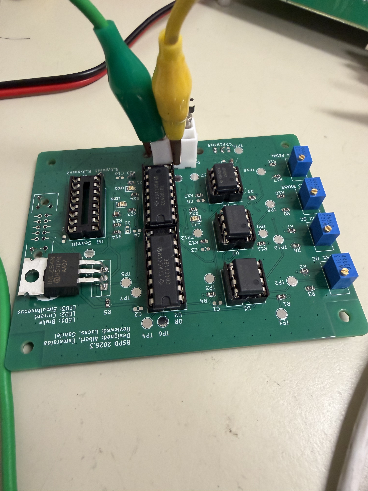
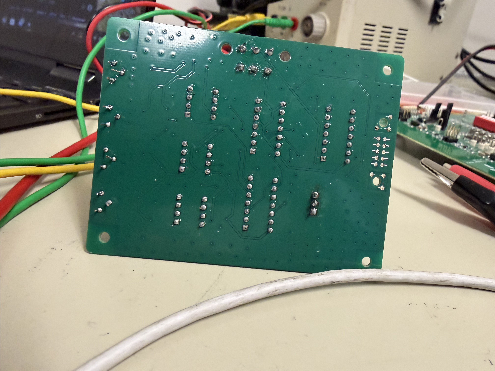
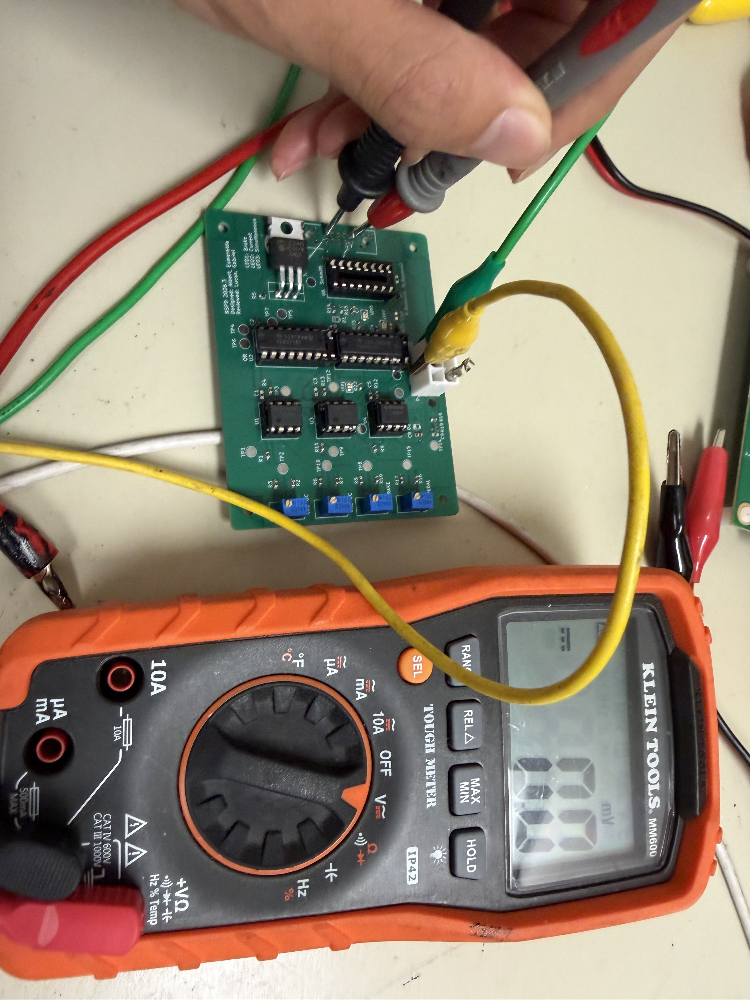
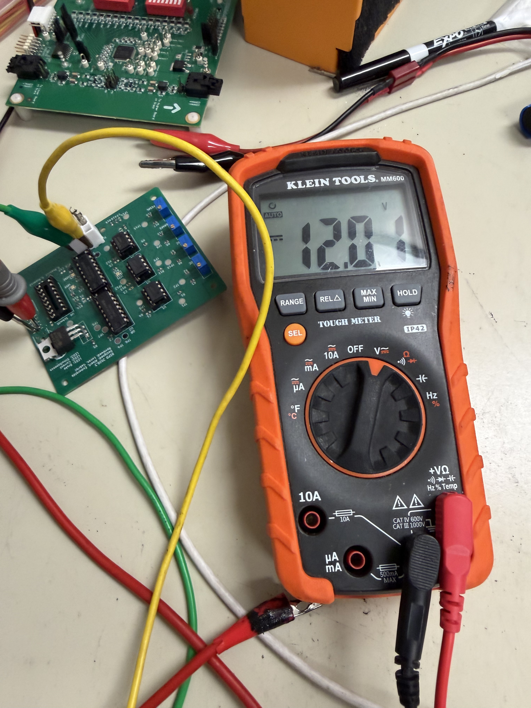
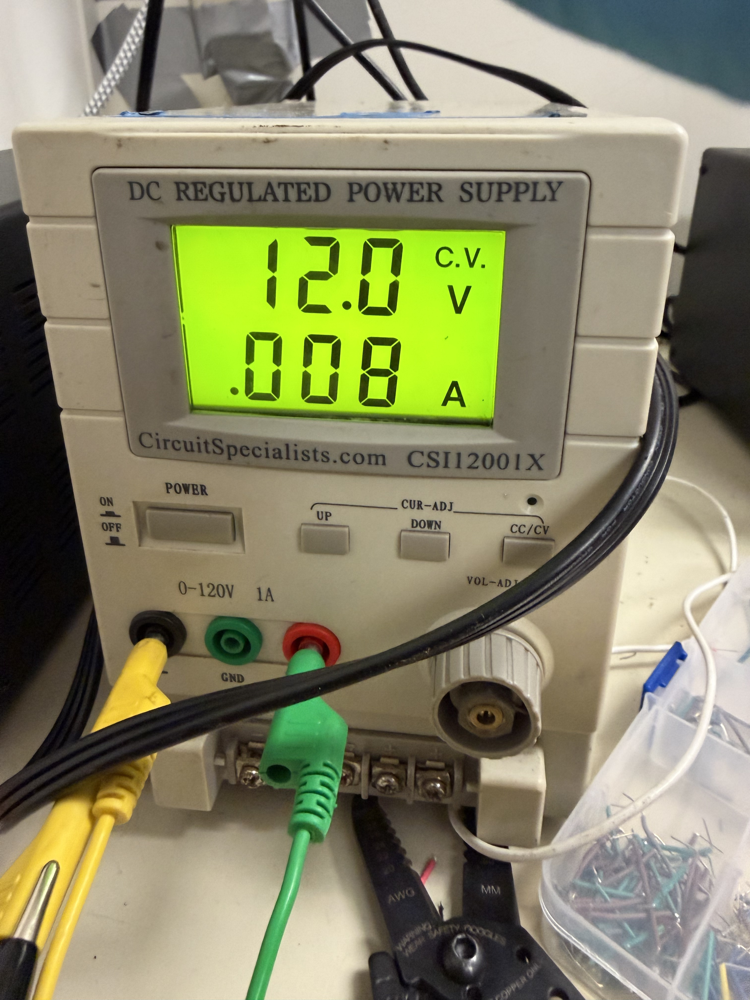
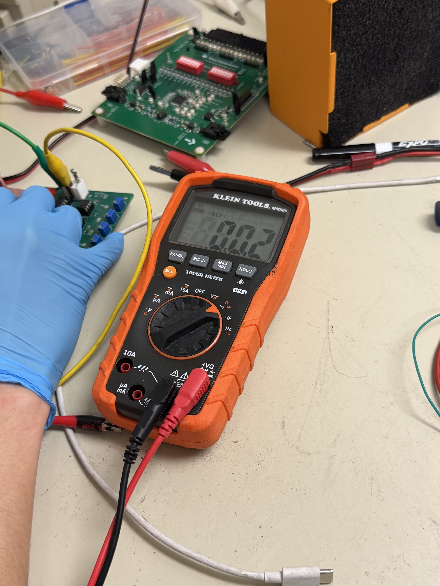
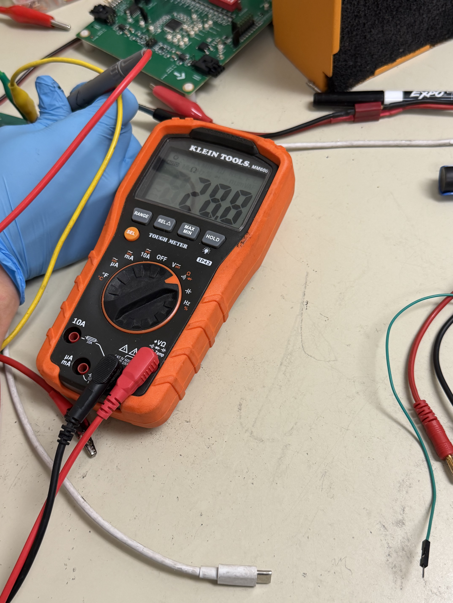
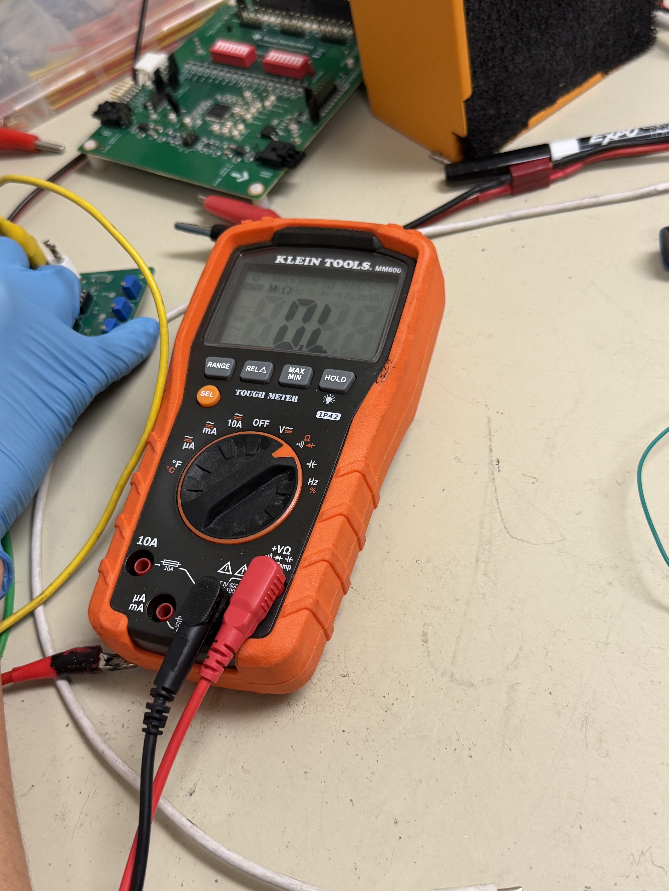
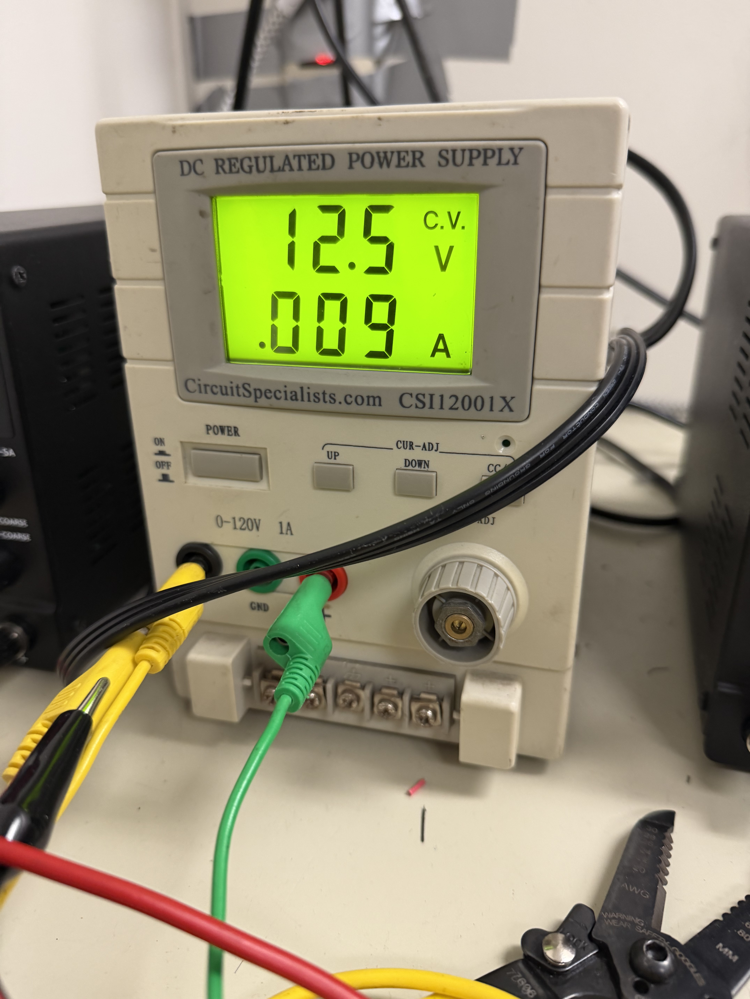
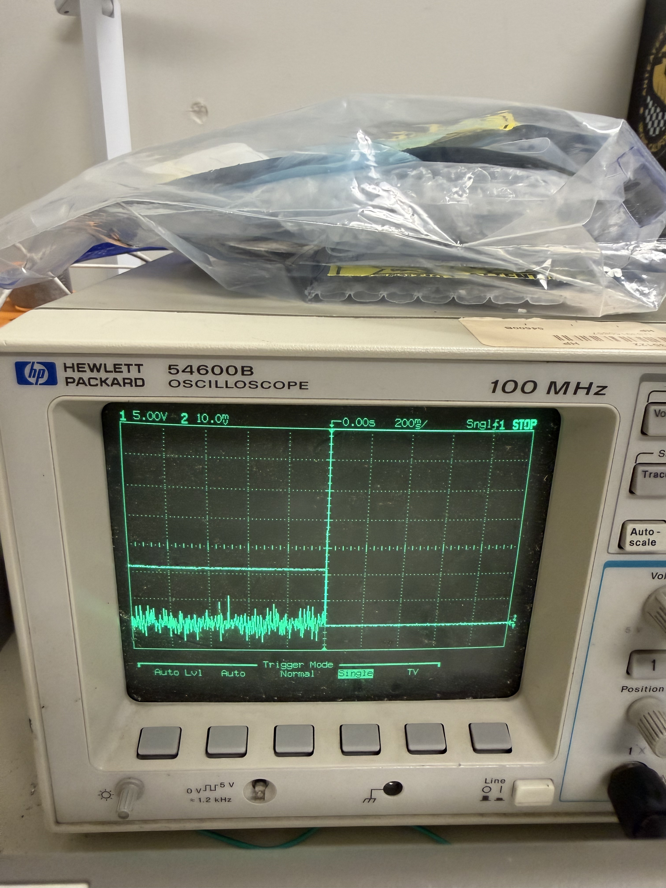

# BSPD Testing Results Report

This document records the results of bench testing and verification performed on the BSPD (Brake System Plausibility Device) board, following the procedure defined in `BSPD_Testing.md`. For design and signal descriptions, see `BSPD_documentation.md`.

**Date:** 3/6/2026  
**Author:** Albert Huang

### Test Summary

| Section | Test | Result |
|---------|------|--------|
| 2.1 | Visual Inspection & Orientation | Pass |
| 2.2 | Part Pinout Verification | Pass |
| 2.3 | Continuity & Power Net Checks | Pass |
| 2.4 | Harness & Wiring Checks | Not tested |
| 3.1 | Initial Power-Up Sanity Check | Pass |
| 3.2 | Supply Voltage Verification | Pass |
| 3.3 | Power Measurement at Test Conditions | Pass |
| 3.4 | Noise & Stability Test | Can't be tested |
| 3.5 | Threshold Margin & Voltage Sweep | Pass |
| 3.6 | Vibration & Temperature Drift Check | Pass |
| 3.7 | BSPD Fault Delay Measurement | Pass |
| 4.1 | Brake Input Test | Pass |
| 4.2 | Current-Channel Input Test | Pass |
| 4.3 | Plausibility Test | Pass |
| 4.4 | Open-Circuit Detection Test | Pass |
| 4.5 | Short-Circuit Detection Test | Can't be tested |
| 4.6 | Debug LED Confirmation | Pass |
| 4.7 | Schmitt Trigger Bypass Evaluation | Can't be tested |

---

## Summary Demonstration

A short bench demonstration of BSPD operation (brake and current channels, plausibility fault, and LED behavior) was recorded (~8 s).

[BSPD summary demonstration video](BSPD_test_media/bspd_summary_video.MOV)

---
### Known Issues & PCB Errata

**Major PCB issue (requires immediate fix on safety board):**

- The short-circuit comparator logic is **inverted**. The comparator should detect **INPUT &lt; SC** (input below short-circuit threshold), but the current design checks **INPUT &gt; SC**. This requires a **pinout swap on the comparators** in the next schematic and board revision. Short-circuit detection test (Section 4.5) is blocked until this is corrected.

**Minor PCB issues (for safety board revision):**

- Missing decoupling caps for ICs and caps for RC networks. Use 0603 SMD devices or change footprint to 0805 in the safety board (which combines multiple boards).
- No Schmitt trigger IC populated, so Section 4.7 could not be tested.
- MOSFET when bent covers the logo; consider moving the logo for better visibility.

---

## 1. Test Environment & Equipment

Testing was performed with the Tractive System disabled and the BSPD isolated from any motor power stage. Equipment used included 3 adjustable GLV bench supplies (power, brake signal, current signal), 1 multimeter, 1 oscilloscope, and the BSPD board under test.

*Figure 1: Bench test setup for BSPD verification.*

---

## 2. Pre-Power Hardware Checklist

These checks were completed **before** power was applied to the board.

### 2.1 Visual Inspection & Orientation

- [x] All ICs (`U1–U6`, `Q1`) have correct orientation (pin 1 markers aligned with silkscreen, notch direction correct).
    *Note: For 14-pin ICs, correct orientation is with the U-shaped notch facing up, not the circle indent.*
- [x] Diodes and polarized components (electrolytic capacitors, LEDs) match silkscreen polarity.
    *Note: On SMD diodes a line indicates polarity. Capacitors used are ceramic (non-electrolytic), so polarity is not applicable.*
- [x] Connectors `J1` and `J2` are the correct part numbers and oriented per drawing (keying and latch direction).
- [x] No visible solder bridges, tombstoned parts, or missing components in critical signal paths (comparators, logic ICs, MOSFET).

*Figure 2: Solder quality and PCB back inspection.*

### 2.2 Part Pinout Verification

- [x] Cross-check pinout for `J2` (primary harness connector) against the table in `BSPD_documentation.md`: Pin 2 is GND, Pin 3 is +12 V, Pins 4/6 are `B_IN` and `C_IN`, Pin 5 is `BSPD_FAULT`.
- [x] Cross-check pinout for `J1` (board-to-board connector) against documentation.

### 2.3 Continuity & Power Net Checks

GND continuity was verified between `J1`, `J2`, and representative GND test points. VDD continuity was verified along the +12 V rail. Resistance between +12 V and GND was confirmed high (no direct short).

**GND continuity (low resistance, near 0 Ω):**

**VDD / +12 V continuity (low resistance along rail):**

**Shorts check (unpowered):** Resistance between +12 V and GND at the connector was measured **high** (no direct short).

*Measured VDD–GND resistance (unpowered): 7.51 kΩ.*

- [x] Verify continuity of **GND**: GND pins between `J1`, `J2`, and test points show low resistance (near 0 Ω).
- [x] Verify continuity of **VDD / +12 V**: +12 V pins show low resistance along the rail.
- [x] Check for shorts: Resistance between +12 V and GND is high (no direct short).

### 2.4 Harness & Wiring Checks (EV.5.2.5 / EV.6.3.2)

- [ ] All wires in the BSPD harness are rated for at least the maximum Tractive System or GLV voltage (TS 420 V DC considered; refer to team SharePoint for color coding).
- [ ] Wire gauge and insulation temperature rating meet or exceed design requirements and applicable rules.
- [ ] Harness documentation (ESF / wiring diagrams) identifies wire gauge, temperature rating, and insulation voltage rating (per EV.6.3.2).
- [ ] No orange wiring used for non–Tractive System circuits; GLV wiring colors follow team standards.
- [ ] Strain relief, bundling, and routing at `J1` / `J2` are adequate.

*Section 2.4 not done yet. Need to finalize connectors/harnessing and proper color coding.*

---

## 3. Power-Up & Electrical Verification

### 3.1 Initial Power-Up Sanity Check

The bench supply was set to 12 V with a conservative current limit (100 mA). +12 V and GND were connected to `J2` per pinout; `B_IN` and `C_IN` were held at 0 V.

- [x] Board powers without exceeding current limit.
- [x] No unexpected heating, smoke, or abnormal smell.
- [x] **Idle supply current** at 12 V: **0.08 A** (within expected range).

*Figure: Idle current measurement at 12 V (0.08 A).*

### 3.2 Supply Voltage Verification

- [x] Voltage at +12 V pins on `J1`/`J2` relative to GND: **12.01 V, 12.01 V, 12.02 V** — no significant deviation across VDD trace.
- [x] GND variation across GND plane: **0 V, 7.9 mV, 0.1 mV** (acceptable).
- [x] Supply voltage at key IC VDD pins verified within 11.5 V–12.5 V tolerance.
- [x] `BSPD_FAULT` output at correct default level with no applied inputs.

**Powered continuity (VDD and GND):**

### 3.3 Power Measurement at Test Conditions

With 12 V applied, supply voltage and current were recorded for each condition:

| Condition              | Supply current (A) | Notes                    |
|------------------------|--------------------|--------------------------|
| No inputs (idle)        | 0.08               | Baseline                 |
| Brake channel only      | 0.05               | B_IN above threshold     |
| Current channel only    | 0.05               | C_IN above threshold     |
| Both channels (fault)   | 0.02               | Plausibility fault state |

- [x] Supply voltage and current recorded for each condition.
- [x] Total power consumption (V × I) within design envelope and connector/wiring ratings.

*Power measurements: no fault, single fault, both faults, and at 12.5 V supply.*

### 3.4 Noise & Stability Test

- [ ] **Not yet performed.** Test requires installation of capacitors. To be completed after board rework.

### 3.5 Threshold Margin & Voltage Sweep Logging

Thresholds and switching behavior were recorded at 11.5 V, 12.0 V, and 12.5 V supply levels.

| Parameter                         | Test condition / notes        | 11.5 V   | 12.0 V   | 12.5 V   |
|----------------------------------|-------------------------------|----------|----------|----------|
| VDD–GND resistance (unpowered)   | At connector before power-up  | 7.51 kΩ  | 7.51 kΩ  | 7.51 kΩ  |
| Idle power consumption           | No inputs asserted            | 11.5 V×0.08 A | 12 V×0.08 A | 12.5 V×0.09 A |
| Open-circuit threshold (OC)      | Voltage at which OC detects   | 5.36 V   | 5.58 V   | 5.82 V   |
| Short-circuit threshold (SC)     | Voltage at which SC detects   | 3.87 V   | 4.03 V   | 4.20 V   |
| Brake threshold                  | `B_IN` at which `B_APPLIED`    | 5.08 V   | 5.28 V   | 5.51 V   |
| Pedal (current) threshold        | `C_IN` at which `P_APPLIED`   | 5.12 V   | 5.32 V   | 5.55 V   |
| Margin to false-trip             | From SC to ~10 V out          | ~0.15 V  | ~0.13 V  | ~0.13 V  |

**MOSFET output data (sample points at each supply):**

- **12.0 V:** IN 3.79 V → OUT 11.9 V; 3.9 V → 10.1 V; 3.93 V → 6.3 V; 3.95 V → 4.5 V; 3.96 V → 2.7 V; 3.97 V → 0.9 V.
- **11.5 V:** IN 3.79 V → OUT 4.35 V; 3.84 V → 0.042 V; 3.67 V → 11.47 V; 3.74 V → 10.4 V; 3.75 V → 9.58 V; 3.81 V → 1.28 V; 3.78 V → 6.45 V.
- **12.5 V:** IN 4.06 V → OUT 11.3 V; 4.11 V → 5.7 V; 4.13 V → 2.48 V; 4.17 V → 0.112 V; 4.07 V → 10.05 V.

### 3.6 Vibration & Temperature Drift Check

**Baseline (room temperature, no vibration):** Normal operation verified via Section 4 functional tests; no unexpected faults.

**Vibration at room temperature:** With inputs set just below and just above threshold for BRAKE and CURRENT channels, vibration was applied. Threshold crossings did not chatter excessively; no spurious `BSPD_FAULT` events. Observed differential around **0.1 V**.

[Vibration test video](BSPD_test_media/vibration_test_edited.mp4)

**Temperature increase (heat gun):** Board was gently warmed with airflow. At elevated temperature (~35 °C above room temp), brake and current-channel thresholds and fault delay were re-checked. Observed differential around **0.3 V**. No false faults during steady inputs.

*Note: Confirm with team the maximum possible temperature inside the enclosure for future testing.*

[Temperature drift test video](BSPD_test_media/temp_test_edited.mp4)

- [x] Vibration: no excessive chatter; no spurious `BSPD_FAULT`.
- [x] Temperature: thresholds and fault delay stable; no false faults.

### 3.7 BSPD Fault Delay Measurement

Delay from valid plausibility condition (both channels above threshold) to assertion of `BSPD_FAULT` was measured. Requirement: **&lt; 0.5 s** under all tested conditions.

- [x] Measured delay **&lt; 10 µs** (no significant delay observed). Confirmed at 12.0 V supply and room temperature. Accurate measurement with oscilloscope and installed capacitors to be repeated as needed.
- [x] Delay remains &lt; 0.5 s and stable across repeated trials.

*Note: This delay was measured without the RC network; delay is estimated to be less than 10 µs.*

*Figure: Oscilloscope capture of BSPD fault response time.*

---

## 4. Functional Test Procedures

### 4.1 Brake Input Test

**Objective:** Verify brake channel threshold behavior without generating a fault when the current channel is inactive (EV.7.7.1).

- [x] `B_APPLIED` asserts when `B_IN` crosses the configured brake threshold.
- [x] No fault outputs (`BSPD_FAULT`, `B_ERROR`, `P_ERROR`, `BOTH_ON`) assert while only the brake channel is above threshold.

*Brake channel threshold and LED indication.*

### 4.2 Current-Channel Input Test

**Objective:** Verify current-channel threshold behavior without generating a fault when the brake channel is inactive (EV.7.7.1).

- [x] `P_APPLIED` asserts when `C_IN` crosses the configured current-channel threshold.
- [x] No fault outputs assert while only the current channel is above threshold.

*Current channel threshold and LED indication.*

### 4.3 Plausibility Test (Simultaneous Application)

**Objective:** Verify that simultaneous brake and current-channel application triggers a BSPD fault with required timing (EV.7.7.2).

- [x] `BOTH_ON` asserts once both channels exceed thresholds.
- [x] `BSPD_FAULT` asserts after the designed delay (&lt; 500 ms; measured &lt; 10 µs).
- [x] Fault remains latched until system reset path is exercised.

*Plausibility fault: both channels above threshold, fault latched.*

### 4.4 Open-Circuit Detection Test

**Objective:** Verify detection of open-circuit conditions on each sensor input (EV.7.7.3).

- [x] Brake input open: `B_OPEN` asserts; BSPD transitions to fault state (`BSPD_FAULT` asserted, appropriate error LED on).
- [x] Current channel open: `P_OPEN` asserts; BSPD enters fault state. (See 4.1 and 4.2 for related behavior.)

### 4.5 Short-Circuit Detection Test

**Objective:** Verify detection of short-to-rail or short-to-ground on each sensor input (EV.7.7.3).

- [ ] **Unable to test** due to comparator polarity error (see Known Issues & PCB Errata at top). Requires schematic and board revision. `B_SHORT` / `P_SHORT` behavior to be verified after fix.

### 4.6 Debug LED Confirmation (v2026.3)

**Objective:** Verify debug LEDs correctly indicate fault categories for bench diagnostics (EV.7.7.4 readiness).

- [x] Brake-side fault (open or short): `B_ERROR` LED1 illuminates.
- [x] Current-channel fault: `P_ERROR` LED2 illuminates.
- [x] Plausibility fault (both channels above threshold): `BOTH_ON` LED3 illuminates. (See images in 4.1, 4.2, 4.3.)

### 4.7 Schmitt Trigger Bypass Evaluation

- [ ] **Not tested.** Schmitt trigger IC was not available (did not arrive / not purchased), and capacitors are missing. To be performed after parts are installed and bypass configuration is selected per `BSPD_documentation.md`.

---

## Items Not Yet Tested

- **3.4 Noise & Stability Test** — Pending capacitor installation.
- **4.5 Short-Circuit Detection Test** — Blocked by comparator polarity bug; requires schematic/board revision.
- **4.7 Schmitt Trigger Bypass Evaluation** — Missing Schmitt trigger IC and capacitors.

---

