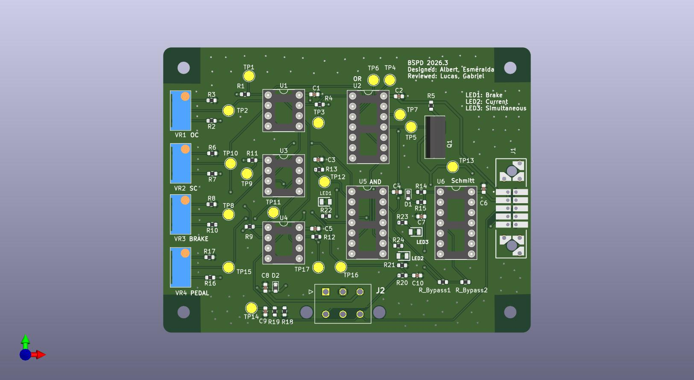
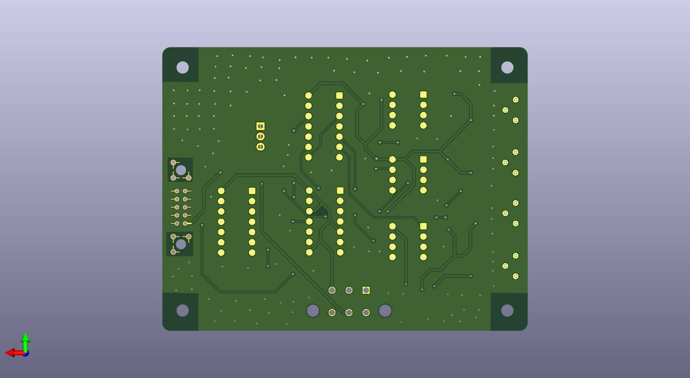

# BSPD (Brake System Plausibility Device) Documentation

## Overview

The Brake System Plausibility Device (BSPD) is a safety-critical circuit required by Formula SAE rules. It monitors driver inputs to detect implausible conditions (for example, brake + torque request simultaneously) and sensor fault conditions (open/short). When a fault condition is detected, the BSPD opens the shutdown circuit to disable the tractive system and latches the fault until a manual reset.

## Version Information

- **Current Version:** 2026.3
- **Previous Versions:** 2026.2, 2026.1
- **Design Tool:** KiCad 9.x (netlist generated by Eeschema 9.0.2 on 2026-02-12)

## Revision History (Log)

| Version | Date | Author | Changes |
|---------|------|--------|---------|
| 2026.1 | Jan 2026 | Albert | Initial design |
| 2026.2 | (internal) | Albert | Fixed routing; added dual ground zones; simplified PCB from 4-layer to 2-layer |
| 2026.3 | (internal) | Albert | Renamed PEDAL to CURRENT (input channel); added debug LEDs for fault indication; updated/revised routing; added via stitching throughout; added board-to-board connector (J1); increased trace width for higher-current signals; changed from separate connectors to 6-pin Molex Mini-Fit Jr (J2); used geographical re-annotate (refdes changed); more detailed naming; switched to smaller trimmers for size reduction; added input pulldown resistors |

**Note on refdes:** 2026.3 used geographical reannotation, so component reference designators may not match older (2026.1) documentation.

---

## High-Level Functional Description

### Purpose

The BSPD ensures vehicle safety by:

1. Detecting simultaneous braking + torque request (implausibility)
2. Detecting sensor open-circuit faults
3. Detecting sensor short-circuit faults
4. Latching any detected fault until a manual reset (via latch board)

### Operating Principle (2026.3 Naming)

The circuit continuously monitors two analog channels:

- **BRAKE** channel (brake pedal sensor)
- **CURRENT** channel (renamed from `PEDAL`; represents the second analog plausibility channel)

External inputs (connectors):

- `B_IN` conditioned into internal net `BRAKE`
- `C_IN` conditioned into internal net `CURRENT`

Threshold comparators generate:

- `BRAKE_APPLIED` (brake above threshold)
- `P_APPLIED` / `PEDAL_APPLIED` (legacy naming in schematic/netlist; corresponds to CURRENT channel applied)

When both channels are simultaneously asserted, `BOTH_ON` becomes true and triggers a fault (with intentional time delay/filtering).

---

## Circuit Architecture (Organized Schematic Stages)

### Stage 1 - Input Conditioning

- Series input resistors on both channels (for example, `B_IN` to `R20` to `BRAKE`, `C_IN` to `R19` to `CURRENT`)
- RC filtering capacitors on the inputs for noise suppression
- Input pulldown resistors added in v2026.3:
  - `BRAKE` to GND via high-value pulldown
  - `CURRENT` to GND via high-value pulldown

These reduce floating-input behavior and improve open-circuit detectability.

### Stage 2 - Threshold Generation (Adjustable)

Trimmer potentiometers (reduced size in v2026.3) generate:

- `BRAKE_THRESHOLD`
- `PEDAL_TH` (legacy net name; corresponds to CURRENT threshold)

### Stage 3 - Comparators

LM393 comparators generate digital status signals:

- Applied detection (`BRAKE_APPLIED`, `P_APPLIED`)
- Open-circuit detection (`B_OPEN`, `P_OPEN`)
- Short-circuit detection (`B_SHORT`, `P_SHORT`)

Comparator outputs feed the fault logic stage.

### Stage 4 - Fault Detection Logic

- Plausibility fault: `BOTH_ON` asserts when brake + current channel are simultaneously above thresholds.
- Open/short faults: open and short comparators assert their respective nets.
- Delay behavior: `BOTH_ON` includes a deliberate RC timing network (approximately 400 ms class behavior) so brief transients do not immediately trip.

### Stage 5 - Fault Aggregation

- OR logic aggregates brake-side faults into `B_ERROR`
- OR logic aggregates current-side faults into `P_ERROR`
- Higher-level OR aggregation yields `FAULT_SENSED` (any fault)

### Stage 6 - Output Conditioning / Latch Interface

Schmitt-trigger inverter stage (40106) provides clean edges and optional latch interfacing depending on system integration.

- Output net: `BSPD_FAULT`

### Stage 7 - Power Switching

MOSFET output stage drives shutdown circuit behavior as designed (fault forces shutdown state).

### Stage 8 - Debug / Bring-Up Indicators (NEW in v2026.3)

Three debug LEDs were added. They illuminate on key fault states:

- `B_ERROR` (brake error LED1)
- `P_ERROR` (current-channel error LED2)
- `BOTH_ON` (simultaneous application LED3)

---

## Interfaces and Connectors (2026.3)

### J2 - Primary Harness Connector (Molex Mini-Fit Jr, 6-pin)

| Pin | Net |
|-----|-----|
| 1 | NC |
| 2 | GND |
| 3 | +12V |
| 4 | B_IN |
| 5 | BSPD_FAULT |
| 6 | C_IN |

### J1 - Board-to-Board Connector (2x5)

Used for board-to-board integration:

| Pin | Net |
|-----|-----|
| 01 | +12V |
| 02 | GND |
| 03 | +12V |
| 04 | GND |
| 05 | C_IN |
| 06 | GND |
| 07 | B_IN |
| 08 | GND |
| 09 | BSPD_FAULT |
| 10 | GND |

---

## Key Components (2026.3)

### Integrated Circuits

| Ref | Value | Notes |
|-----|-------|-------|
| U1, U3, U4 | LM393 | Dual comparators (applied + open/short detection) |
| U5 | 4081 | Quad 2-input AND gate (silkscreen label: AND) |
| U2 | 4071 | Quad 2-input OR gate (silkscreen label: OR) |
| U6 | 40106 | Hex Schmitt trigger inverter (silkscreen label: SCHMITT) |

### Potentiometers / Trimmers (UPDATED in v2026.3)

| Ref | Value |
|-----|-------|
| VR1-VR4 | 3296Y-11-103LF |

### Debug LEDs (NEW in v2026.3)

| Ref | Value |
|-----|-------|
| LED1-LED3 | APTD2012LSYCK |

### Output Transistor

| Ref | Value |
|-----|-------|
| Q1 | IRLIZ44N NMOS |

### Test Points (2026.3 Net Names)

Important: these do not match the 2026.1 TP table.

| Test Point | Net |
|------------|-----|
| TP1 | B_SHORT |
| TP2 | OC |
| TP3 | B_OPEN |
| TP4 | P_ERROR |
| TP5 | FAULT_SENSED |
| TP6 | B_ERROR |
| TP7 | BOTH_ON |
| TP8 | BRAKE_TH |
| TP9 | B_APPLIED |
| TP10 | SC |
| TP11 | P_SHORT |
| TP12 | P_APPLIED |
| TP13 | BSPD_FAULT |
| TP14 | PEDAL (legacy naming; corresponds to CURRENT channel node in schematic/netlist) |
| TP15 | PEDAL_TH (CURRENT threshold) |
| TP16 | BRAKE |
| TP17 | P_OPEN |

---

## PCB / Layout Information (2026.3)

### Layer Stack

- 2-layer PCB (since v2026.2)

### Grounding

- Dual ground zones (since v2026.2)
- Via stitching (v2026.3): stitching vias distributed throughout to improve ground connectivity between layers and reduce impedance

### Trace Width (v2026.3)

Trace widths were increased for higher-current and power-related nets (for example, +12V distribution, MOSFET/output path) per team PCB current-carrying guidelines.

### Silkscreen / Serviceability (v2026.3)

- ICs are explicitly labeled on silkscreen by function:
  - AND gate (`U5`)
  - OR gate (`U2`)
  - Schmitt (`U6`)
- Schematic is staged (functional blocks separated and labeled) to match debug workflow

### DRC Status (v2026.3)

- All DRC checks passed: no errors, no warnings

---

## Calibration & Setup

### Threshold Adjustment

Thresholds are adjustable using four trimmers:

- Two trimmers for BRAKE threshold network
- Two trimmers for CURRENT-channel threshold network (legacy net names may still use `PEDAL`)

### Recommended Threshold Targets

| Parameter | Recommended Value | Notes |
|-----------|-------------------|-------|
| Brake threshold | ~10% travel | Match intended sensor scaling |
| Current-channel threshold | ~25% travel | Match intended scaling for plausibility channel |
| Fault delay | <500 ms | Implemented via RC delay network on plausibility path |

---

## Testing Procedures (Bring-Up)

### Brake Input Test

- Ramp brake input
- Confirm `B_APPLIED` at threshold
- Ensure no fault when other channel is inactive

### Current-Channel Input Test

- Ramp current-channel input
- Confirm `P_APPLIED` at threshold
- Ensure no fault when brake is inactive

### Plausibility Test

- Assert both channels beyond thresholds
- Confirm `BOTH_ON` asserts and then `BSPD_FAULT`
- Verify latch/reset behavior per system integration

### Open Circuit Test

- Disconnect brake input and confirm `B_OPEN` and fault
- Disconnect current input and confirm `P_OPEN` and fault

### Short Circuit Test

- Force brake short condition and confirm `B_SHORT` and fault
- Force current short condition and confirm `P_SHORT` and fault

### Debug LED Confirmation (v2026.3)

Induce each fault type and confirm corresponding LED behavior:

- Brake faults to `B_ERROR` LED1
- Current-channel faults to `P_ERROR` LED2
- Implausibility overlap to `BOTH_ON` LED3

---

## Documentation Assets

### 3D Views

**Front View**

**Rear View**

### PDF Documents

- [PCB Schematic PDF](./PCB_Schematic.pdf)
- [PCB Layout Color PDF](./PCB_Layout_Color.pdf)

Embedded PCB Schematic (if viewer supports inline PDF)

<object data="./PCB_Schematic.pdf" type="application/pdf" width="100%" height="700">
  
Inline PDF preview not supported. Open <a href="./PCB_Schematic.pdf">PCB_Schematic.pdf</a>.

</object>

Embedded PCB Layout Color (if viewer supports inline PDF)

<object data="./PCB_Layout_Color.pdf" type="application/pdf" width="100%" height="700">
  
Inline PDF preview not supported. Open <a href="./PCB_Layout_Color.pdf">PCB_Layout_Color.pdf</a>.

</object>

