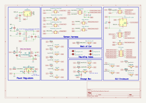
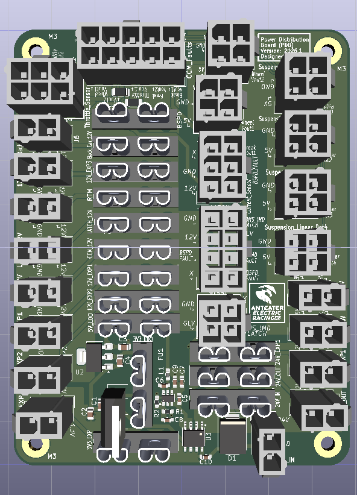
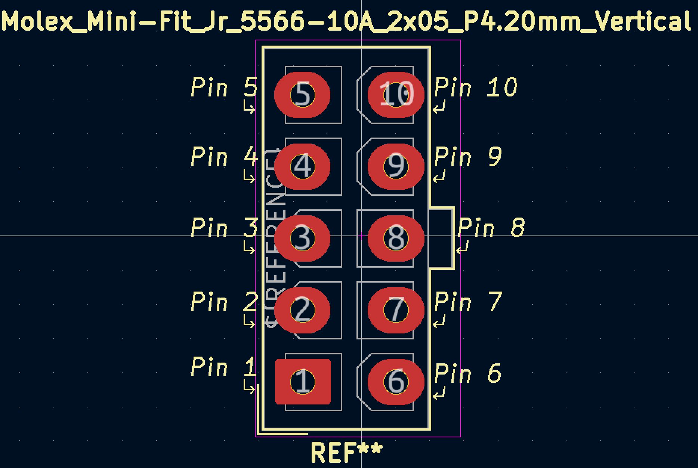

# Power Distribution Board (PDB)
**Reviewers:**
 - *Gabriel Schoene*
 - *Avadi Seneviratne*
 - *Lucas Li*

---

## Overview
With a 24V input from the DC-DC converter, the Power Distribution Board (PDB) 
provides 24V, 12V, 5V, and 3V3 to other circuits in the car.

Current Sensor module is included for BSPD, as well as connecting some control
signals across PCBs.

> [!NOTE]
> KiCAD Project is created with version 9.0.8

**PDB Schematic**

**PCB**

---

## Function and Purpose
The PDB provides voltage input for other PCBs across the car, and 
follows Overcurrent Protection Rules (EV.6.6), where each Mini-Fit Jr.
Connector is in series with a fuse.

---

## Design Decisions
For schematic side, 12V battery has been removed, leaving 24V input
as the only input voltage. A Buck Converter was selected to step down
24V to 12V. Although ripples will be generated from Switching Regulator,
a Switching Regulator is more perferred as a Low-Dropout Regulator 
(LDO) would provide too much power dissipation from a 12V dropout 
voltage.

---

To follow PCB guidelines, each Molex Connector have labels for each
pin, for better documentation and easier harnessing process.

Since this board has multiple Molex connectors, a footprint template
is setup by modifying the footprint to must also include labels for 
each pin. This then groups the Molex footprint with the silkscreen, 
where moving the part both moves the footprint and the silkscreen labels.

---

With Front of Car (FOC) Enclosure having a smaller dimension, the 
goal for this PCB is to be as small as possible. After reiterating
from last year's design, the overall board size is now within 100x100mm. 

Modifications that reduced board area:
 - Removal of extra Mini-Fit Jr. Connectors
 - Replace Glass Fuses with Blade Fuses instead
 - Using Power Planes instead of traces
 - Replace Screw Terminal Voltage input with Mini-Fit Jr.
 - Reroute all components

... Also with PCB orders from JLCPCB, the overall price can be decreased with
a PCB design under 100x100mm.

---

## Testing Instructions
1. Verify all components are installed.
2. Verify ICs are in correct orientation.
3. Verify TSV diode orientation.
4. Ensure all silkscreen pinout names match with PCB layout.
5. Ensure all silkscreen text is legible and not blocked.
6. Check for Overcurrent Protection.
7. Check severity of Switching Regulator Ripple.
8. Powerup and check for current sensor output.

---

## Iterations
Possible Improvements:
 - Decoupling Capacitors across power plane splits, to decrease noise overall
 - Double check PDB operation with Ansys Simulation
 - Add filters for signal integrity and cleaner Current Sensor output
 - Ensure a continous GND plane for better noise reduction
 - Reroute and optimize placements again
